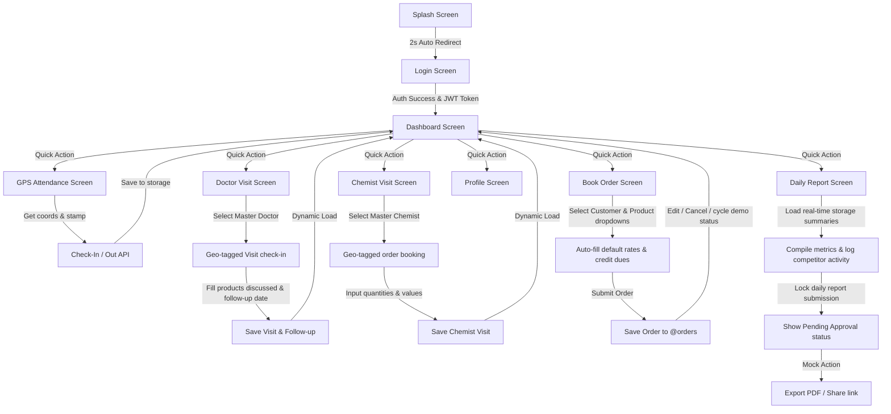

# MJ Healthcare Pharma ERP — MR Mobile App Workflow & Flow Design

This document details the architecture, screen flow, and implementation status for the **Medical Representative (MR) Mobile Application** (Member 3 responsibility), aligned with the client's **Scope of Work (SOW)** and **Software Requirement Specifications (SRS)**.

---

## 1. Team Division & Scope Alignment

Based on the team structure, the project is divided as follows:
*   **Member 1 (Backend)**: APIs, Authentication, Database (PostgreSQL + Prisma), and Route/GPS verification servers.
*   **Member 2 (Web Portal)**: React Admin Dashboard for HO, Warehouse managers, and Stocks/Distributor reports.
*   **Member 3 (You - Mobile App)**: **React Native Expo Application** for the field Medical Representatives (MR), including UI, state management, Offline Storage (`AsyncStorage`), and GPS tracking integration.

---

## 2. End-to-End MR Mobile App Flow Chart

---

## 3. Screen-by-Screen Functional Mapping (10/10 ERP Grade)

### 3.1 Splash & Login Screens
*   **Splash Screen**: Automatically redirects to Login after 2 seconds. Renders the HD corporate branding logo.
*   **Login Screen**: Secure user credentials form. Authenticates against the backend API and stores the session token.

### 3.2 Dynamic Home Dashboard
*   **Header Logo**: Compact, professional top header banner.
*   **Live Attendance Status**: Displays check-in status (🟢 Checked In at HH:MM / 🔴 Attendance Not Marked) pulled from local storage.
*   **Today's Metrics**: Real-time counter cards displaying **Doctor Visits**, **Chemist Visits**, and **Total Sales** compiled from storage.
*   **Monthly Target Trackers**: Dynamic progress bars tracking sales (against ₹50,000 target), doctor visits (against 30 target), and chemist visits (against 20 target).
*   **Follow-Up Reminders**: Dynamically filters doctor visit logs and displays the next 3 scheduled follow-ups.

### 3.3 GPS Attendance Screen
*   **Location Permissions**: Checks and requests device geolocation permissions.
*   **Geo-Verification**: Fetches high-accuracy GPS coordinates (Latitude + Longitude) and looks up the reverse-geocoded address.
*   **Check-In / Check-Out**: Submits location parameters to local storage and the API.

### 3.4 Doctor Visit Screen
*   **Predefined Registry**: Select doctor from master data.
*   **Geo-Tagging**: Matches MR position to the doctor's clinic coordinates.
*   **Inputs**: logs discussion notes, sample materials given, remarks, and schedules the next follow-up date.
*   **History**: Lists today's logs chronologically.

### 3.5 Chemist Visit Screen
*   **Registry**: Select chemist shop from master database.
*   **Inputs**: Medicine ordered, quantities, and order value (auto-summed).

### 3.6 Book Order Screen (Sales Engine)
*   **Client Selection**: Dropdown lists sorted by Doctors, Chemists, or Hospitals. Auto-fills contact numbers.
*   **Credit Limit Checker**: Instantly pulls outstanding balances (Doctors: ₹0, Chemists: ₹1,800 to ₹7,200, Hospitals: ₹4,500 to ₹28,000) and displays the calculated new balance.
*   **Product Registry**: Preloaded product catalog. Selecting a item auto-fills default rates to speed up booking.
*   **Status Management**: Tapping status badges cycles status (`Pending` 🔄 `Approved` 🔄 `Delivered` 🔄 `Cancelled`) for client demonstrations.
*   **Search**: Dynamic filter matching order numbers, customer names, or products.
*   **Edit / Cancel**: Allows modifying pending orders or cancelling them safely.

### 3.7 Daily Report Screen (Field Summary)
*   **Work Compilation**: Auto-summarizes today's logged metrics (Doctor/Chemist visits, orders count, average order value, total sales).
*   **Remarks & Market Intelligence**: Input area for daily achievements and competitor activities (offers, products).
*   **Status Locking**: Submitting locks the report as `"Pending Approval"`.
*   **Mock Exports**: Native-style buttons to mock-export reports as PDF or copy shareable links.

---

## 4. Current App Completion & Next Module Recommendations

The MR Mobile application is currently **80% complete** for a client-ready pilot demo.

To achieve a true **100% completion** on the Mobile module, the following screen extensions are recommended in the future:
1.  **Tour Plan Screen**: A calendar interface to plan which areas, chemists, and doctors to visit next week.
2.  **Meeting Scheduler**: Screen to schedule company conferences, stockist meetings, or Zonal head visits.
3.  **Dedicated CRM Follow-up Screen**: A comprehensive calendar view of all follow-ups scheduled from doctor visits, with a checkbox to mark them as completed.
4.  **Product Promotion Screen**: A visual slide deck or catalog containing brochure images and details of the company's medicine catalog to showcase to doctors.
